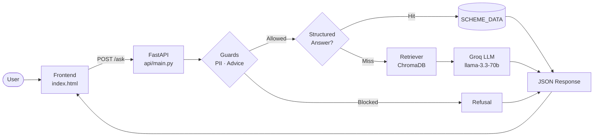

# HDFC Mutual Fund FAQ Assistant

A production-grade, facts-only conversational FAQ assistant for HDFC Mutual Fund schemes — built on a Retrieval-Augmented Generation (RAG) pipeline. Answers investor questions from verified official sources (HDFC PDFs, AMFI, SEBI), refuses investment advice, and blocks personal information. Zero hallucination on structured scheme data.

---

## Project Scope

| Attribute | Detail |
|-----------|--------|
| **Supported AMC** | HDFC Mutual Fund |
| **Corpus Sources** | HDFC Fund Facts PDFs, KIMs, SIDs · AMFI education pages · SEBI investor portal · Custom structured facts |
| **Supported Schemes** | 5 schemes across Equity and Fund of Funds categories |
| **Product Context** | Investor-facing FAQ chatbot — answers factual questions, not advisory ones |
| **Key Constraints** | Facts-only (no investment advice) · No PII accepted · Answers grounded in official corpus only · Max 3 sentences per answer |

---

## Supported Schemes

| Scheme | Category | Fund Manager |
|--------|----------|--------------|
| HDFC Flexi Cap Fund | Equity — Flexi Cap | Chirag Setalvad |
| HDFC Mid Cap Fund | Equity — Mid Cap | Srinivas Rao Ravuri |
| HDFC Small Cap Fund | Equity — Small Cap | Srinivas Rao Ravuri |
| HDFC Defence Fund | Equity — Thematic | Amit Sethiya |
| HDFC Silver ETF Fund of Fund | Fund of Funds — Commodity | Anil Bamboli |

---

## Key Features

- **Facts-only answers** — Every response is grounded in the official document corpus. The assistant never fabricates data or extrapolates beyond its sources.
- **Structured scheme metadata** — Expense ratio, minimum SIP, exit load, benchmark, riskometer, fund manager, and AUM are resolved from a verified in-memory data dictionary — no LLM involved for these fields.
- **RAG-based retrieval** — Open-ended questions query a ChromaDB vector store (500 embedded chunks from 21 official sources) using `all-MiniLM-L6-v2` embeddings.
- **Dual-layer answer generation** — A structured answer layer intercepts known intents before reaching the LLM; unknown queries fall through to Groq's `llama-3.3-70b-versatile` with a strict facts-only prompt.
- **Safety guards** — An advisory keyword filter and PII regex guard run on every request before any processing begins.
- **FAQ shortcuts** — One-click category buttons (Expense Ratio, Minimum SIP, Exit Load, Riskometer, Benchmark, Fund Manager, AUM, Capital Gains) auto-generate and submit the correct question for the selected scheme.
- **Scheme-specific questions** — Users select a scheme from the header, then all FAQ buttons generate queries scoped to that scheme.
- **Source attribution** — Every answer includes a "Last updated from sources: June 2026" timestamp.

---

## Architecture Overview

The system has two distinct execution paths: a fast structured path for known intents, and a full RAG + LLM path for open-ended questions.

```
User Input
    │
    ▼
┌─────────────────────┐
│  Frontend           │  ← Single-page HTML chat UI (Tailwind CSS + Vanilla JS)
│  index.html         │    Scheme selector · FAQ buttons · Chat bubbles
└────────┬────────────┘
         │ POST /ask
         ▼
┌─────────────────────┐
│  FastAPI API        │  ← api/main.py
│  /ask  /health      │    CORS · Pydantic validation · Error handling
└────────┬────────────┘
         │
         ▼
┌─────────────────────┐
│  Safety Guards      │  ← rag/guards.py
│  PII · Advice       │    Blocks before any retrieval or LLM call
└────────┬────────────┘
         │
         ├──── Structured intent? ────►  SCHEME_DATA dict  ──► Answer ✓
         │                               (no LLM, no DB)
         │
         ▼ (fallback)
┌─────────────────────┐
│  RAG Retriever      │  ← rag/retriever.py
│  ChromaDB           │    Semantic search · top-5 chunks · Custom Facts re-ranked first
└────────┬────────────┘
         │
         ▼
┌─────────────────────┐
│  LLM Generation     │  ← rag/assembler.py + Groq API
│  llama-3.3-70b      │    Facts-only prompt · temp 0.3 · max 500 tokens
└────────┬────────────┘
         │
         ▼
     JSON Response  →  Frontend renders answer bubble
```



---

## Tech Stack

### Backend
| Component | Technology | Version |
|-----------|-----------|---------|
| Language | Python | 3.9+ |
| API Framework | FastAPI | 0.109.0 |
| API Server | Uvicorn | 0.27.0 |
| PDF Extraction | pypdf | 4.0.1 |
| HTML Extraction | BeautifulSoup4 | 4.12.3 |
| HTTP Client | requests | 2.31.0 |
| Environment Config | python-dotenv | 1.0.0 |
| Testing | pytest | 7.4.4 |

### AI / RAG
| Component | Technology | Version |
|-----------|-----------|---------|
| Vector Database | ChromaDB | 0.4.22 |
| Embedding Model | sentence-transformers (`all-MiniLM-L6-v2`) | ≥ 2.7.0 |
| Numerical Compute | NumPy | < 2.0 |
| LLM Provider | Groq API (`llama-3.3-70b-versatile`) | — |
| LLM Client | groq | 0.5.0 |

### Frontend
| Component | Technology |
|-----------|-----------|
| Markup | HTML5 (single file, no build step) |
| Styling | Tailwind CSS (CDN) |
| Logic | Vanilla JavaScript (ES2020) |
| Typography | Inter (Google Fonts) |
| Icons | Material Symbols Outlined |

---

## Folder Structure

```
hdfc-mf-faq/
│
├── docs/
│   ├── Problemstatement.md           ← Original requirements and build plan
│   └── phase-wise-architecture.md    ← Full technical architecture (all 12 phases)
│
├── ingest/                           ← One-time data pipeline
│   ├── fetcher.py                    ← Downloads 21 official sources to data/raw/
│   ├── extractor.py                  ← Extracts plain text + metadata headers
│   ├── chunker.py                    ← Splits text into 500-word overlapping chunks
│   └── embedder.py                   ← Embeds chunks into ChromaDB via all-MiniLM-L6-v2
│
├── rag/                              ← Runtime inference layer
│   ├── retriever.py                  ← Semantic search over ChromaDB (top-5 chunks)
│   ├── assembler.py                  ← Structured answers + LLM prompt builder
│   └── guards.py                     ← PII and investment advice filters
│
├── api/
│   └── main.py                       ← FastAPI app — POST /ask, GET /health
│
├── frontend/
│   └── index.html                    ← Full chat UI (scheme selector, FAQ buttons, chat)
│
├── stitch/
│   ├── DESIGN.md                     ← Design system (colors, typography, spacing)
│   ├── code.html                     ← UI prototype component
│   └── screen.png                    ← Design mockup
│
├── data/
│   ├── raw/                          ← 21 downloaded PDFs + HTML files
│   ├── extracted/                    ← Plain text with metadata headers (24 files)
│   ├── chunks/chunks.jsonl           ← 500 word-chunked documents
│   └── chroma/                       ← ChromaDB vector store (SQLite + HNSW index)
│
├── tests/
│   └── test_fund_manager_aum.py      ← 19 unit tests (intents, aliases, data completeness)
│
├── sources.csv                       ← Corpus inventory — 21 verified official source URLs
├── custom_facts.txt                  ← Structured scheme facts (canonical source of truth)
├── requirements.txt                  ← Pinned Python dependencies
├── .env.example                      ← Environment variable template
└── .gitignore
```

---

## Getting Started

### Prerequisites

- Python 3.9+
- A free [Groq API key](https://console.groq.com/keys)

### 1. Install dependencies

```bash
pip3 install -r requirements.txt
```

### 2. Configure environment

```bash
cp .env.example .env
# Edit .env and add your Groq API key:
# GROQ_API_KEY=your_groq_api_key_here
```

### 3. Run the ingest pipeline (first time only)

```bash
python3 ingest/fetcher.py      # Download 21 official sources
python3 ingest/extractor.py    # Extract text from PDFs + HTML
python3 ingest/chunker.py      # Chunk into 500-word segments
python3 ingest/embedder.py     # Embed into ChromaDB
```

> The ingest pipeline is idempotent. Re-running it skips already-downloaded files.  
> To rebuild ChromaDB from scratch: `rm -rf data/chroma/ && python3 ingest/embedder.py`

### 4. Start the API

```bash
python3 -m uvicorn api.main:app --reload
# API live at:  http://127.0.0.1:8000
# Swagger docs: http://127.0.0.1:8000/docs
```

### 5. Open the frontend

```bash
# Option A — open directly (simplest)
open "frontend/index.html"

# Option B — serve locally (recommended, avoids browser file:// restrictions)
cd frontend && python3 -m http.server 3000
# Then open: http://localhost:3000
```

### 6. Run the test suite

```bash
python3 -m pytest tests/ -v
# Expected: 19 passed
```

---

## API Reference

### `POST /ask`

Submit a question and receive a structured answer.

**Request**
```json
{
  "question": "Who is the fund manager of HDFC Flexi Cap Fund?"
}
```

**Response**
```json
{
  "status": "answered",
  "answer": "The fund manager of HDFC Flexi Cap Fund is Chirag Setalvad.",
  "citation_url": "",
  "last_updated": "June 2026"
}
```

**Status values:** `answered` · `refused`

### `GET /health`

```json
{ "status": "ok" }
```

---

## Sample Questions & Answers

| Question | Answer |
|----------|--------|
| What is the expense ratio of HDFC Flexi Cap Fund? | The expense ratio of HDFC Flexi Cap Fund – Direct Plan is 0.85%. |
| What is the minimum SIP for HDFC Defence Fund? | The minimum SIP amount for HDFC Defence Fund is ₹500 per installment. |
| What is the riskometer of HDFC Mid Cap Fund? | HDFC Mid Cap Fund is classified as Very High Risk on the Riskometer. |
| Who is the fund manager of HDFC Flexi Cap Fund? | The fund manager of HDFC Flexi Cap Fund is Chirag Setalvad. |
| What is the AUM of HDFC Mid Cap Fund? | The assets under management (AUM) of HDFC Mid Cap Fund are ₹41,892 crore. |
| Should I invest in HDFC Mid Cap Fund? | *(Politely refused — advice not provided)* |
| *(PAN / Aadhaar / phone number)* | *(Blocked — PII not accepted)* |

---

## Documentation

| Document | Description |
|----------|-------------|
| [`docs/Problemstatement.md`](docs/Problemstatement.md) | Original requirements, corpus inventory, build phases, and success criteria |
| [`docs/phase-wise-architecture.md`](docs/phase-wise-architecture.md) | Full 12-phase technical architecture — data flow, component design, dependency rationale, sequence diagrams |

---

## Design System

The UI follows a custom Material Design–inspired token system defined in [`stitch/DESIGN.md`](stitch/DESIGN.md).

| Token | Value | Usage |
|-------|-------|-------|
| `primary` | `#ba0013` | HDFC brand red — buttons, active states |
| `secondary` | `#565e74` | Labels, metadata text |
| `surface` | `#f7f9fb` | App background |
| `on-surface` | `#191c1e` | Primary body text |

Typeface: **Inter** · Spacing: 8pt grid · Shadows: ambient (`rgba(15,23,42,0.05)`)

---

## Future Enhancements

| Priority | Enhancement | Description |
|----------|-------------|-------------|
| High | **Multi-AMC support** | Extend corpus and `SCHEME_DATA` to cover SBI MF, Mirae Asset, Axis, ICICI Prudential |
| High | **Auto-refresh data** | Scheduled monthly re-ingest of Fund Facts PDFs to keep AUM and fund manager data current |
| Medium | **Fund comparison** | Side-by-side factual comparison of two schemes (expense ratio, exit load, benchmark) |
| Medium | **Citation URL per answer** | Surface the source document URL from the top RAG chunk in every response |
| Medium | **Docker deployment** | Containerise the API and ship to Railway, Render, or Fly.io |
| Medium | **Conversation memory** | Multi-turn context so users can ask follow-up questions without repeating the scheme name |
| Low | **Portfolio analytics** | Read-only portfolio summary from uploaded CAS statements |
| Low | **Voice interface** | Web Speech API for voice input; text-to-speech for answers |
| Low | **Hindi language support** | Query handling in Hindi for broader retail investor accessibility |
| Low | **Regular Plan data** | Extend `SCHEME_DATA` to include Regular Plan expense ratios alongside Direct |

---

## Known Constraints

- AUM and fund manager values in `SCHEME_DATA` are point-in-time (June 2026). They do not update automatically.
- ChromaDB is local and single-process. Not suitable for concurrent multi-user production deployments without a shared vector store.
- The embedding model (`all-MiniLM-L6-v2`) is general-purpose English. It has not been fine-tuned on Indian financial terminology.
- The LLM fallback path requires a valid Groq API key. Structured answers (expense ratio, SIP, riskometer, exit load, benchmark, fund manager, AUM) work without one.

---

## License

This project is for educational and portfolio purposes. All scheme data is sourced from publicly available HDFC Mutual Fund, AMFI, and SEBI documents.
