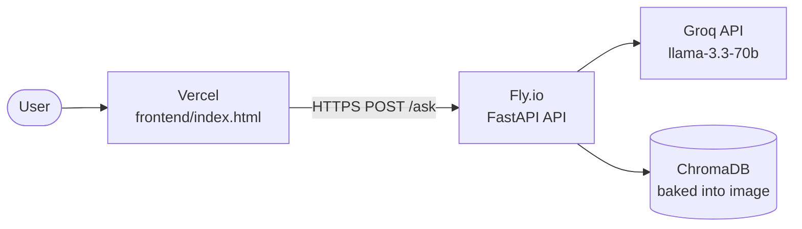

# Deployment Plan

## HDFC Mutual Fund FAQ Assistant
### Backend → Fly.io · Frontend → Vercel

> **Last updated:** June 2026

---

## Overview

| Component | Platform | What it runs |
|-----------|----------|-------------|
| **Backend API** | [Fly.io](https://fly.io) | FastAPI + ChromaDB + Groq LLM (Docker container) |
| **Frontend UI** | [Vercel](https://vercel.com) | Static HTML chat UI |



**Deployment order:**
1. Deploy **Fly.io** backend → get the public URL
2. Update `RENDER_URL` in `frontend/index.html` with the Fly.io URL → push
3. Deploy **Vercel** frontend

> **Note:** ChromaDB is pre-built and committed to the repo (1.6 MB).  
> The ingest pipeline never runs on the server — zero OOM risk.

---

## Prerequisites

| Requirement | Where to get it |
|-------------|----------------|
| GitHub account with repo pushed | [github.com](https://github.com) |
| Fly.io account | [fly.io](https://fly.io) — sign up free |
| Vercel account | [vercel.com](https://vercel.com) — sign up free with GitHub |
| Groq API key | [console.groq.com/keys](https://console.groq.com/keys) — free |
| flyctl CLI | See Step 1 |

---

## Fly.io Free Tier

| Feature | Free Allowance |
|---------|---------------|
| VMs | 3 × shared-cpu-1x (256 MB) **or** use allowance for 1 × 512 MB |
| Bandwidth | 160 GB outbound / month |
| Persistent Volumes | 3 GB free |
| Sleep on inactivity | Yes (`auto_stop_machines = true`) — first request wakes it |
| Always-on | Set `min_machines_running = 1` in fly.toml (uses free allowance) |

---

## Part 1 — Backend: Fly.io

### Step 1 — Install flyctl

**macOS (Homebrew):**
```bash
brew install flyctl
```

**macOS (without Homebrew):**
```bash
curl -L https://fly.io/install.sh | sh
```

Verify:
```bash
flyctl version
```

---

### Step 2 — Sign up and log in

```bash
flyctl auth signup    # new account
# OR
flyctl auth login     # existing account
```

This opens a browser tab. Authenticate and return to the terminal.

---

### Step 3 — Launch the app on Fly.io

Run this from the project root:

```bash
cd "/Users/rukhsarkhan/Documents/LIP3 HDFC "
flyctl launch
```

Fly.io will detect the `Dockerfile` and `fly.toml`. Answer the prompts:

```
? Would you like to copy its configuration to the new app?  → Yes
? Choose an app name (leave blank for auto-generated):      → hdfc-mf-faq-api
? Choose a region:                                          → pick closest to you
? Would you like to set up a Postgresql database?           → No
? Would you like to set up an Upstash Redis database?       → No
? Would you like to deploy now?                             → No  (we set the secret first)
```

---

### Step 4 — Set the Groq API key

```bash
flyctl secrets set GROQ_API_KEY=your_groq_api_key_here
```

Verify it was saved:
```bash
flyctl secrets list
```

---

### Step 5 — Deploy

```bash
flyctl deploy
```

Fly.io builds the Docker image and deploys. Watch the output:

```
==> Building image
==> Pushing image to registry
==> Creating release
==> Monitoring deployment

  ✓  Machine e286553b91d508 [app] update finished: success
  ✓  Deployment complete!
```

**Expected build time:** 3–5 minutes (Docker image build).  
**Expected boot time:** ~15 seconds (ChromaDB is pre-built — no ingest runs).

---

### Step 6 — Get your Fly.io URL

```bash
flyctl info
```

Your URL will look like:
```
https://hdfc-mf-faq-api.fly.dev
```

Or open it directly in the browser:
```bash
flyctl open
```

---

### Step 7 — Test the API

```bash
# Health check
curl https://hdfc-mf-faq-api.fly.dev/health
# → {"status":"ok"}

# Expense ratio
curl -X POST https://hdfc-mf-faq-api.fly.dev/ask \
  -H "Content-Type: application/json" \
  -d '{"question": "What is the expense ratio of HDFC Flexi Cap Fund?"}'
# → {"status":"answered","answer":"The expense ratio of HDFC Flexi Cap Fund – Direct Plan is 0.85%.",...}

# Fund manager
curl -X POST https://hdfc-mf-faq-api.fly.dev/ask \
  -H "Content-Type: application/json" \
  -d '{"question": "Who is the fund manager of HDFC Flexi Cap Fund?"}'
# → {"status":"answered","answer":"The fund manager of HDFC Flexi Cap Fund is Chirag Setalvad.",...}

# AUM
curl -X POST https://hdfc-mf-faq-api.fly.dev/ask \
  -H "Content-Type: application/json" \
  -d '{"question": "What is the AUM of HDFC Mid Cap Fund?"}'
# → {"status":"answered","answer":"The assets under management (AUM) of HDFC Mid Cap Fund are ₹41,892 crore.",...}
```

✅ **Fly.io backend is live.**

---

## Part 2 — Update Frontend with Fly.io URL

Open `frontend/index.html` and find (~line 457):

```javascript
const BACKEND_URL = "https://YOUR-APP.fly.dev";
```

Replace `YOUR-APP` with your actual Fly.io app name:

```javascript
const BACKEND_URL = "https://hdfc-mf-faq-api.fly.dev";
```

Commit and push:

```bash
git add frontend/index.html
git commit -m "config: set Fly.io production API URL"
git push
```

---

## Part 3 — Frontend: Vercel

### Step 8 — Sign in to Vercel

Go to **[vercel.com](https://vercel.com)** → sign in with GitHub.

---

### Step 9 — Import repository

1. Click **Add New** → **Project**
2. Select **RAG-based-Mutual-Fund-FAQ-Chatbot** → **Import**

---

### Step 10 — Configure

| Setting | Value |
|---------|-------|
| **Framework Preset** | `Other` |
| **Root Directory** | click **Edit** → type `frontend` → **Continue** |
| **Build Command** | *(leave empty)* |
| **Output Directory** | *(leave empty)* |

Click **Deploy** — ready in ~10 seconds.

```
https://hdfc-mf-faq-assistant.vercel.app
```

✅ **Full app is live.**

---

## Post-Deployment Checklist

### Fly.io
- [ ] `flyctl status` shows `running`
- [ ] `curl /health` returns `{"status":"ok"}`
- [ ] Logs show `Pre-built ChromaDB found — skipping ingest pipeline entirely`
- [ ] `GROQ_API_KEY` secret is set (`flyctl secrets list`)

### Vercel
- [ ] Deployment status is **Ready**
- [ ] `BACKEND_URL` in `frontend/index.html` is the Fly.io URL
- [ ] All scheme buttons work
- [ ] All FAQ category buttons return correct answers

---

## Useful flyctl Commands

```bash
# View live logs
flyctl logs

# Check app status and URL
flyctl status
flyctl info

# Open app in browser
flyctl open

# SSH into the container
flyctl ssh console

# Scale memory up (if needed)
flyctl scale memory 1024

# Redeploy after code changes
flyctl deploy

# Rotate Groq API key
flyctl secrets set GROQ_API_KEY=new_key_here

# Destroy app (if needed)
flyctl apps destroy hdfc-mf-faq-api
```

---

## Redeployment

Push to `main` and redeploy:

```bash
git push
flyctl deploy
```

Vercel auto-deploys on every push. Fly.io does not auto-deploy from GitHub by default unless you connect GitHub Actions.

### Auto-deploy from GitHub (optional)

Add `.github/workflows/fly-deploy.yml`:

```yaml
name: Deploy to Fly.io
on:
  push:
    branches: [main]
jobs:
  deploy:
    runs-on: ubuntu-latest
    steps:
      - uses: actions/checkout@v4
      - uses: superfly/flyctl-actions/setup-flyctl@master
      - run: flyctl deploy --remote-only
        env:
          FLY_API_TOKEN: ${{ secrets.FLY_API_TOKEN }}
```

Set `FLY_API_TOKEN` in GitHub repo → Settings → Secrets:
```bash
flyctl auth token   # copy this value into GitHub secret
```

---

## Troubleshooting

| Symptom | Cause | Fix |
|---------|-------|-----|
| `flyctl launch` fails | Not logged in | `flyctl auth login` |
| Build fails | Docker error | `flyctl logs` → check error |
| First request slow (5–30 sec) | Machine was sleeping | Normal — wakes on demand. Set `min_machines_running = 1` to avoid |
| OOM error | Memory exceeded 512 MB | `flyctl scale memory 1024` |
| `GROQ_API_KEY` missing | Secret not set | `flyctl secrets set GROQ_API_KEY=...` |
| Frontend shows "Sorry, error" | Wrong Fly.io URL in frontend | Check `BACKEND_URL` in `frontend/index.html` |
| CORS error | Origin not allowed | Keep `allow_origins=["*"]` in `api/main.py` |

---

## Deployment Files

| File | Purpose |
|------|---------|
| `Dockerfile` | Builds the Fly.io container from `python:3.11-slim` |
| `start.sh` | Startup script — detects pre-built ChromaDB, starts uvicorn on `$PORT` |
| `.dockerignore` | Excludes `.env`, `__pycache__`, `stitch/` from Docker build |
| `fly.toml` | Fly.io app config — Docker build, HTTP service, VM size |
| `data/chroma/` | Pre-built vector store (1.6 MB) — committed to repo, no OOM on server |
| `frontend/vercel.json` | Vercel static site config |
