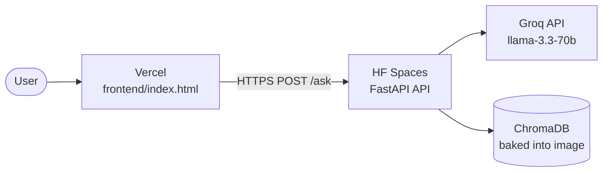

# Deployment Plan

## HDFC Mutual Fund FAQ Assistant
### Backend → Hugging Face Spaces · Frontend → Vercel

> **Last updated:** June 2026  
> **Cost: 100% Free — No credit card required**

---

## Overview

| Component | Platform | Cost | Card Required |
|-----------|----------|------|--------------|
| **Backend API** | [Hugging Face Spaces](https://huggingface.co/spaces) | Free | ❌ No |
| **Frontend UI** | [Vercel](https://vercel.com) | Free | ❌ No |



**Deployment order:**
1. Deploy **Hugging Face Spaces** backend → get the public URL
2. Update `BACKEND_URL` in `frontend/index.html` → push to GitHub
3. Deploy **Vercel** frontend

> **ChromaDB is pre-built and in the repo (1.6 MB) — no ingest pipeline runs on the server.**

---

## Why Hugging Face Spaces?

| Feature | HF Spaces (Free) |
|---------|-----------------|
| RAM | 16 GB |
| CPU | 2 vCPU |
| Storage | 50 GB |
| Sleep on inactivity | ❌ Never sleeps |
| Credit card required | ❌ No |
| Docker support | ✅ Yes |
| Best for | ML / AI projects |

---

## Prerequisites

| Requirement | Where to get it |
|-------------|----------------|
| Hugging Face account | [huggingface.co/join](https://huggingface.co/join) — free, no card |
| HF write token | [huggingface.co/settings/tokens](https://huggingface.co/settings/tokens) |
| Vercel account | [vercel.com](https://vercel.com) — sign up with GitHub |
| Groq API key | [console.groq.com/keys](https://console.groq.com/keys) — free |

---

## Part 1 — Backend: Hugging Face Spaces

### Step 1 — Create a Hugging Face account

Go to **[huggingface.co/join](https://huggingface.co/join)**

- Enter your email, username, password
- Verify your email
- **No credit card required**

---

### Step 2 — Create a new Space

Go to **[huggingface.co/new-space](https://huggingface.co/new-space)**

Fill in the form:

| Field | Value |
|-------|-------|
| **Owner** | your HF username |
| **Space name** | `hdfc-mf-faq-api` |
| **SDK** | `Docker` |
| **Visibility** | `Public` |

Click **Create Space**.

---

### Step 3 — Add your Groq API key as a secret

1. Inside your Space, click **Settings** tab
2. Scroll to **Repository secrets**
3. Click **New secret**
4. Add:
   - **Name:** `GROQ_API_KEY`
   - **Value:** your Groq API key from [console.groq.com/keys](https://console.groq.com/keys)
5. Click **Save**

---

### Step 4 — Get a Hugging Face write token

Go to **[huggingface.co/settings/tokens](https://huggingface.co/settings/tokens)**

1. Click **New token**
2. Name: `deploy-token`
3. Role: **Write**
4. Click **Generate a token**
5. **Copy the token** — you'll use it in the next step

---

### Step 5 — Push your code to HF Spaces

Open the Zed terminal and run:

```bash
cd "/Users/rukhsarkhan/Documents/LIP3 HDFC "
git remote add hf https://huggingface.co/spaces/YOUR-HF-USERNAME/hdfc-mf-faq-api
git push hf main
```

When prompted for credentials:
```
Username: YOUR-HF-USERNAME
Password: paste your HF write token here (not your account password)
```

HF Spaces starts building automatically.

---

### Step 6 — Watch the build

Go to your Space URL:
```
https://huggingface.co/spaces/YOUR-HF-USERNAME/hdfc-mf-faq-api
```

Click the **Logs** tab. You'll see:

```
========================================
  HDFC Mutual Fund FAQ Assistant
========================================

Pre-built ChromaDB found — skipping ingest pipeline entirely.
No embedding runs on the server. Zero OOM risk.
Starting API server on 0.0.0.0:8000...
INFO:     Application startup complete.
```

**Expected build time: 5–10 minutes** (Docker image build + dependency install).  
**Boot time after build: ~15 seconds.**

When the Space shows **Running** (green) → it's live.

---

### Step 7 — Get your HF Spaces URL

Your API URL will be:
```
https://YOUR-HF-USERNAME-hdfc-mf-faq-api.hf.space
```

For example:
```
https://rukhsar24081998-hdfc-mf-faq-api.hf.space
```

---

### Step 8 — Test the API

```bash
# Health check
curl https://YOUR-HF-USERNAME-hdfc-mf-faq-api.hf.space/health
# → {"status":"ok"}

# Expense ratio
curl -X POST https://YOUR-HF-USERNAME-hdfc-mf-faq-api.hf.space/ask \
  -H "Content-Type: application/json" \
  -d '{"question": "What is the expense ratio of HDFC Flexi Cap Fund?"}'
# → {"status":"answered","answer":"The expense ratio of HDFC Flexi Cap Fund – Direct Plan is 0.85%.",...}

# Fund manager
curl -X POST https://YOUR-HF-USERNAME-hdfc-mf-faq-api.hf.space/ask \
  -H "Content-Type: application/json" \
  -d '{"question": "Who is the fund manager of HDFC Flexi Cap Fund?"}'
# → {"status":"answered","answer":"The fund manager of HDFC Flexi Cap Fund is Chirag Setalvad.",...}

# AUM
curl -X POST https://YOUR-HF-USERNAME-hdfc-mf-faq-api.hf.space/ask \
  -H "Content-Type: application/json" \
  -d '{"question": "What is the AUM of HDFC Mid Cap Fund?"}'
# → {"status":"answered","answer":"The assets under management (AUM) of HDFC Mid Cap Fund are ₹41,892 crore.",...}
```

✅ **HF Spaces backend is live.**

---

## Part 2 — Update Frontend with HF Spaces URL

Open `frontend/index.html` and find (~line 457):

```javascript
const BACKEND_URL = "https://YOUR-APP.fly.dev";
```

Replace with your HF Spaces URL:

```javascript
const BACKEND_URL = "https://rukhsar24081998-hdfc-mf-faq-api.hf.space";
```

Commit and push:

```bash
cd "/Users/rukhsarkhan/Documents/LIP3 HDFC "
git add frontend/index.html
git commit -m "config: set HF Spaces production API URL"
git push
```

Then push the update to HF Spaces too:

```bash
git push hf main
```

---

## Part 3 — Frontend: Vercel

### Step 9 — Sign in to Vercel

Go to **[vercel.com](https://vercel.com)** → sign in with GitHub.

---

### Step 10 — Import repository

1. Click **Add New** → **Project**
2. Select **RAG-based-Mutual-Fund-FAQ-Chatbot** → **Import**

---

### Step 11 — Configure

| Setting | Value |
|---------|-------|
| **Framework Preset** | `Other` |
| **Root Directory** | click **Edit** → type `frontend` → **Continue** |
| **Build Command** | *(leave empty)* |
| **Output Directory** | *(leave empty)* |

Click **Deploy** — ready in ~10 seconds.

```
https://hdfc-mf-faq-assistant.vercel.app
```

✅ **Full app is live — 100% free.**

---

## Post-Deployment Checklist

### Hugging Face Spaces
- [ ] Space status shows **Running** (green)
- [ ] `GET /health` returns `{"status": "ok"}`
- [ ] Logs show `Pre-built ChromaDB found — skipping ingest pipeline entirely`
- [ ] `GROQ_API_KEY` secret is set in Space settings

### Vercel
- [ ] Deployment status is **Ready**
- [ ] `BACKEND_URL` in `frontend/index.html` is the HF Spaces URL
- [ ] All scheme buttons return correct answers
- [ ] Fund Manager and AUM buttons work
- [ ] Advisory questions are refused

---

## Redeployment — Updating Code

Any time you push changes to GitHub, you also push to HF Spaces:

```bash
git add .
git commit -m "your change"
git push             # updates GitHub + Vercel auto-deploys
git push hf main     # updates HF Spaces → rebuilds Docker image
```

---

## Troubleshooting

| Symptom | Cause | Fix |
|---------|-------|-----|
| Push to HF fails with 403 | Wrong token or username | Use write token as password, not account password |
| Space stuck on "Building" | Large Docker image | Wait — dependencies (~2 GB) take time to install |
| Space shows error after build | Check Logs tab | Look for Python import errors |
| "Sorry, I encountered an error" | Wrong BACKEND_URL | Check `BACKEND_URL` in `frontend/index.html` matches HF Space URL |
| CORS error in browser | Origin blocked | Keep `allow_origins=["*"]` in `api/main.py` |
| GROQ_API_KEY not found | Secret not set | Space → Settings → Repository secrets → add GROQ_API_KEY |
| OOM error | Should not happen | HF free tier has 16 GB RAM — far more than needed |

---

## Deployment Files Reference

| File | Purpose |
|------|---------|
| `README.md` | HF Spaces frontmatter (`sdk: docker`, `app_port: 8000`) at top |
| `Dockerfile` | Builds the container from `python:3.11-slim` |
| `start.sh` | Detects pre-built ChromaDB, starts uvicorn on port 8000 |
| `.dockerignore` | Excludes `.env`, `__pycache__`, `stitch/` from Docker build |
| `data/chroma/` | Pre-built vector store (1.6 MB) — no OOM on server |
| `fly.toml` | Kept for future Fly.io use (not active) |
| `frontend/vercel.json` | Vercel static site config |
