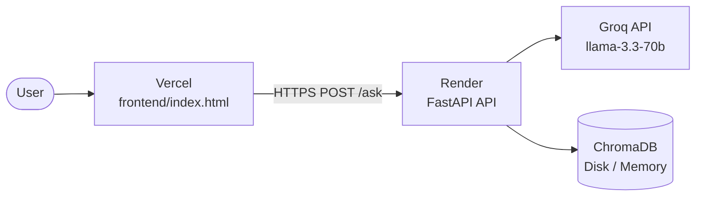

# Deployment Plan

## HDFC Mutual Fund FAQ Assistant
### Backend → Render · Frontend → Vercel

> **Last updated:** June 2026

---

## Overview

The application has two independently deployed components:

| Component | Platform | What it runs |
|-----------|----------|-------------|
| **Backend API** | [Render](https://render.com) | FastAPI + ChromaDB + Groq LLM (Docker container) |
| **Frontend UI** | [Vercel](https://vercel.com) | Static HTML chat UI |



**Deployment order:**
1. Deploy **Render** first → get the public URL
2. Update `RENDER_URL` in `frontend/index.html` with that URL → push to GitHub
3. Deploy **Vercel** → frontend calls the live API

---

## Prerequisites

| Requirement | Where to get it |
|-------------|----------------|
| GitHub account with repo pushed | [github.com](https://github.com) |
| Render account | [render.com](https://render.com) — sign up free with GitHub |
| Vercel account | [vercel.com](https://vercel.com) — sign up free with GitHub |
| Groq API key | [console.groq.com/keys](https://console.groq.com/keys) — free |

---

## Render Free Tier — What to Expect

| Feature | Free Tier | Starter ($7/month) |
|---------|-----------|-------------------|
| RAM | 512 MB | 512 MB |
| CPU | 0.1 vCPU | 0.5 vCPU |
| Persistent Disk | ❌ Not included | ✅ $0.25/GB/month |
| Spin-down on inactivity | ✅ After 15 min | ❌ Always on |
| Cold start delay | 30–60 sec (first request after sleep) | None |
| Ingest pipeline | Runs on every cold start (~5 min) | Runs once (with disk) |

> **Recommendation:** Use the free tier to test. Upgrade to Starter if you want the ingest pipeline to run only once and no spin-down delays.

---

## Part 1 — Backend: Render

### Step 1 — Sign up / Log in

Go to **[render.com](https://render.com)** → click **Get Started for Free** → sign in with GitHub.

---

### Step 2 — Create a new Web Service

1. From the Render dashboard, click **+ New** → **Web Service**
2. Select **Build and deploy from a Git repository**
3. Connect your GitHub account if prompted
4. Find and select **RAG-based-Mutual-Fund-FAQ-Chatbot** → click **Connect**

---

### Step 3 — Configure the service

On the configuration screen, set:

| Field | Value |
|-------|-------|
| **Name** | `hdfc-mf-faq-api` |
| **Region** | Choose closest to your users |
| **Branch** | `main` |
| **Runtime** | `Docker` |
| **Dockerfile Path** | `./Dockerfile` |
| **Instance Type** | `Free` |

> Render auto-detects the `render.yaml` in your repo and may pre-fill these fields.

---

### Step 4 — Add the Groq API key

Scroll down to **Environment Variables** and add:

```
GROQ_API_KEY = your_groq_api_key_here
```

> Get a free key at: **[console.groq.com/keys](https://console.groq.com/keys)**  
> Render injects `PORT` automatically — do not set it manually.

---

### Step 5 — (Optional) Add a Persistent Disk

> Skip this step on the free tier. The ingest pipeline will re-run on each cold start (~5 min) but the app will still work correctly.

On paid plans (Starter+):
1. Scroll to the **Disks** section
2. Click **Add Disk**
3. Set:
   - **Name:** `app-data`
   - **Mount Path:** `/app/data`
   - **Size:** `1 GB`

With the disk attached, the ingest pipeline runs **once** and ChromaDB persists across all future deploys.

---

### Step 6 — Deploy

Click **Create Web Service**.

Render begins building the Docker image. Watch the **Logs** tab:

```
==> Building Docker image...
==> Starting service...

========================================
  HDFC Mutual Fund FAQ Assistant
========================================

[1/4] Downloading 21 official sources...
Done! Downloaded: 21, Skipped: 0, Failed: 0

[2/4] Extracting text from PDFs and HTML...
Done! Processed 22 files

[3/4] Chunking into 500-word segments...
Done! Created 500 chunks in data/chunks/chunks.jsonl

[4/4] Embedding into ChromaDB (this takes 2-4 minutes)...
Done! Added 500 chunks to ChromaDB

Ingest pipeline complete. ChromaDB ready.
Starting API server on 0.0.0.0:10000...
INFO:     Application startup complete.
```

⏱ **First deploy takes 5–10 minutes** (Docker build + ingest pipeline).  
Subsequent deploys skip the ingest step if a disk is attached.

---

### Step 7 — Get your Render URL

Once the service shows **Live** (green), your URL appears at the top of the page:

```
https://hdfc-mf-faq-api.onrender.com
```

---

### Step 8 — Test the API

```bash
# Health check
curl https://hdfc-mf-faq-api.onrender.com/health
# → {"status":"ok"}

# Test expense ratio (structured answer — no LLM)
curl -X POST https://hdfc-mf-faq-api.onrender.com/ask \
  -H "Content-Type: application/json" \
  -d '{"question": "What is the expense ratio of HDFC Flexi Cap Fund?"}'
# → {"status":"answered","answer":"The expense ratio of HDFC Flexi Cap Fund – Direct Plan is 0.85%.",...}

# Test fund manager
curl -X POST https://hdfc-mf-faq-api.onrender.com/ask \
  -H "Content-Type: application/json" \
  -d '{"question": "Who is the fund manager of HDFC Flexi Cap Fund?"}'
# → {"status":"answered","answer":"The fund manager of HDFC Flexi Cap Fund is Chirag Setalvad.",...}
```

✅ **Render backend is live.**

---

## Part 2 — Update Frontend with Render URL

### Step 9 — Set your Render URL in the frontend

Open `frontend/index.html` in Zed and find this line (~line 455):

```javascript
const RENDER_URL = "https://YOUR-APP.onrender.com";
```

Replace it with your actual Render URL:

```javascript
const RENDER_URL = "https://hdfc-mf-faq-api.onrender.com";
```

Save the file, commit, and push:

```bash
cd "/Users/rukhsarkhan/Documents/LIP3 HDFC "
git add frontend/index.html
git commit -m "config: set Render production API URL"
git push
```

---

## Part 3 — Frontend: Vercel

### Step 10 — Sign up / Log in

Go to **[vercel.com](https://vercel.com)** → sign in with GitHub.

---

### Step 11 — Import your repository

1. Click **Add New** → **Project**
2. Find **RAG-based-Mutual-Fund-FAQ-Chatbot** → click **Import**

---

### Step 12 — Configure the project

| Setting | Value |
|---------|-------|
| **Framework Preset** | `Other` |
| **Root Directory** | click **Edit** → type `frontend` → click **Continue** |
| **Build Command** | *(leave empty)* |
| **Output Directory** | *(leave empty)* |

---

### Step 13 — Deploy

Click **Deploy**. Vercel builds in ~10 seconds.

Your live URL will look like:

```
https://hdfc-mf-faq-assistant.vercel.app
```

---

### Step 14 — Test the full app

1. Open your Vercel URL
2. Select **HDFC Flexi Cap Fund**
3. Click **Expense Ratio** → `"The expense ratio of HDFC Flexi Cap Fund – Direct Plan is 0.85%."`
4. Click **Fund Manager** → `"The fund manager of HDFC Flexi Cap Fund is Chirag Setalvad."`
5. Click **AUM** → `"The assets under management (AUM) of HDFC Flexi Cap Fund are ₹52,347 crore."`
6. Type `"Should I invest in HDFC Mid Cap Fund?"` → polite refusal ✅

✅ **Full app is live.**

---

## Post-Deployment Checklist

### Render

- [ ] Service status shows **Live** (green)
- [ ] `GET /health` returns `{"status": "ok"}`
- [ ] Logs show "Ingest pipeline complete" or "ChromaDB found"
- [ ] `GROQ_API_KEY` environment variable is set
- [ ] (Paid only) Persistent disk attached at `/app/data`

### Vercel

- [ ] Deployment status is **Ready**
- [ ] `RENDER_URL` in `frontend/index.html` matches your live Render URL
- [ ] All 5 scheme buttons work
- [ ] All FAQ category buttons return correct answers
- [ ] Advisory questions are refused
- [ ] PII inputs are blocked

---

## Environment Variables

### Render (required)

| Variable | Value | Notes |
|----------|-------|-------|
| `GROQ_API_KEY` | `gsk_...` | From [console.groq.com/keys](https://console.groq.com/keys) |
| `PORT` | Auto-set by Render (default: `10000`) | Do not override |

### Vercel

No environment variables required. The Render URL is set directly in `frontend/index.html` as `RENDER_URL`.

---

## Deployment Files Reference

| File | Purpose |
|------|---------|
| `Dockerfile` | Builds the Render container from `python:3.11-slim` |
| `start.sh` | Startup script — runs ingest pipeline if needed, then starts uvicorn on `$PORT` |
| `.dockerignore` | Excludes `data/`, `.env`, `__pycache__`, `stitch/` from Docker build |
| `render.yaml` | Render Blueprint — service type, Docker config, env vars, optional disk |
| `frontend/vercel.json` | Vercel static site config (`cleanUrls`, `trailingSlash`) |

---

## Redeployment & Updates

### Updating source code

Push to `main` — Render and Vercel both auto-deploy via GitHub.

```bash
git add .
git commit -m "fix: update SCHEME_DATA for new fund facts"
git push
```

- **Render:** rebuilds the Docker image, restarts the container. Disk data persists (if attached).
- **Vercel:** rebuilds the static site in ~10 seconds.

### Rebuilding ChromaDB from scratch

```bash
# Via Render Shell (Dashboard → Service → Shell tab)
rm -rf data/chroma data/raw data/extracted data/chunks

# Then redeploy — start.sh re-runs the full ingest pipeline automatically
```

### Rotating the Groq API key

Render dashboard → Service → **Environment** tab → update `GROQ_API_KEY` → **Save Changes**.  
Render auto-restarts the service.

---

## Troubleshooting

| Symptom | Likely cause | Fix |
|---------|-------------|-----|
| Build fails | Docker build error | Check Render build logs; verify `requirements.txt` |
| "Sorry, I encountered an error" | Frontend can't reach Render API | Check `RENDER_URL` in `frontend/index.html`; check Render service is Live |
| First request very slow (30–60 sec) | Free tier spin-down | Normal behaviour — service wakes up on first request. Upgrade to Starter to avoid. |
| Ingest re-runs on every deploy | No persistent disk | Add disk at `/app/data` (Starter plan) |
| `GROQ_API_KEY` error in logs | Key not set | Add it in Render → Environment tab |
| Vercel shows 404 | Wrong root directory | Set Root Directory to `frontend` in Vercel project settings |
| CORS error in browser | `allow_origins` mismatch | Keep `allow_origins=["*"]` in `api/main.py` or add your Vercel domain |
| Health check failing | Ingest still running on first boot | Normal — Render retries; ingest takes ~5 min |

---

## Architecture Decisions

### Why Render for the backend?

- Native Docker support — `render.yaml` + `Dockerfile` deploy with zero config changes
- Free tier available for testing; paid Starter plan adds persistent disk and no spin-down
- `$PORT` is injected automatically — `start.sh` passes it directly to uvicorn
- Auto-deploy from GitHub on every push to `main`

### Why Vercel for the frontend?

- Zero-config static HTML deployment from a GitHub repo subdirectory
- Global CDN — sub-100ms load times worldwide
- Auto-deploy on every `git push`
- Free tier has no bandwidth or build limits for static sites

### Why split deployments?

| Benefit | Detail |
|---------|--------|
| Independent scaling | Frontend (static) and backend (compute) scale separately |
| Independent rollback | Roll back the frontend without touching the API |
| Faster frontend deploys | Vercel rebuilds in ~10 sec; Render rebuilds in ~5–10 min |
| Cost separation | Frontend is always free on Vercel; backend cost is isolated to Render |

### CORS

The backend currently allows all origins (`allow_origins=["*"]`). For production hardening, restrict it to your Vercel domain in `api/main.py`:

```python
app.add_middleware(
    CORSMiddleware,
    allow_origins=[
        "http://localhost:3000",
        "https://hdfc-mf-faq-assistant.vercel.app",
    ],
    allow_methods=["POST", "GET"],
    allow_headers=["Content-Type"],
)
```

---

## Resource Requirements

### Render (Backend)

| Resource | Free Tier | Notes |
|----------|-----------|-------|
| RAM | 512 MB | `all-MiniLM-L6-v2` ~250 MB; FastAPI + ChromaDB ~100 MB |
| CPU | 0.1 vCPU | Fine for API requests; ingest is slow but completes |
| Disk | None (free) / 1 GB (paid) | Without disk: ingest re-runs on cold start |
| Network | Outbound | First-boot ingest fetches PDFs from HDFC/AMFI/SEBI |

### Vercel (Frontend)

| Resource | Value |
|----------|-------|
| Bandwidth | Minimal — single static HTML file (~150 KB) |
| Build time | ~10 seconds |
| CDN regions | Global (100+ edge locations) |
