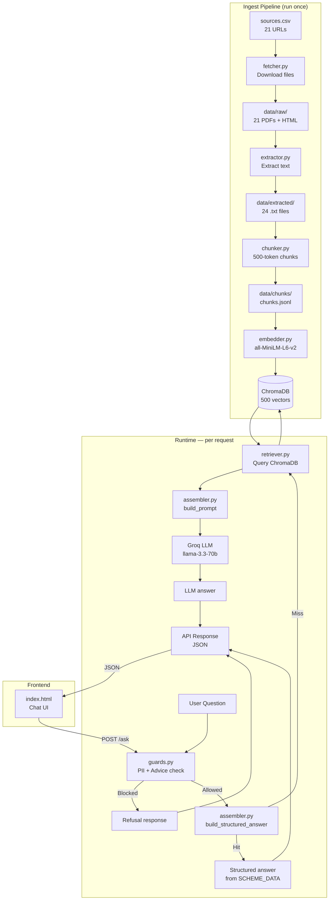
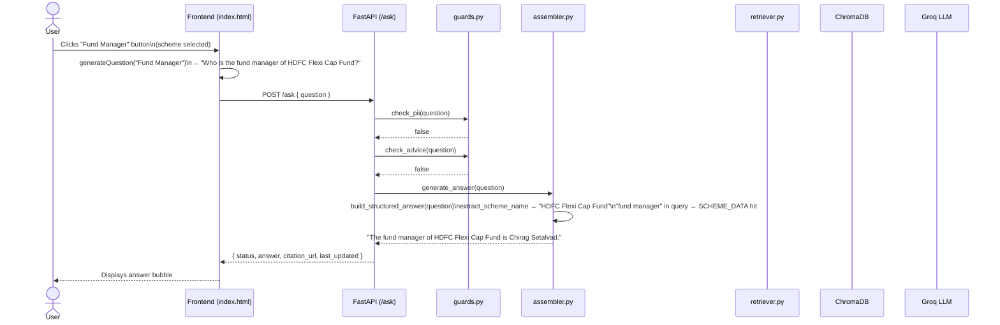
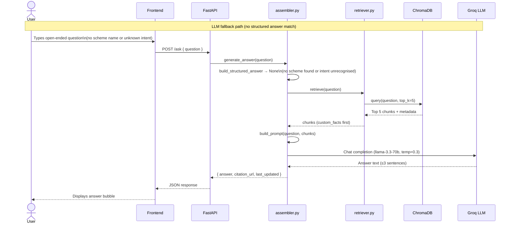

# HDFC Mutual Fund FAQ Assistant — Phase-Wise Architecture

> **Last updated:** June 2026  
> **Status:** All phases implemented and verified ✅

---

## Table of Contents

1. [Project Overview](#1-project-overview)
2. [High-Level Architecture](#2-high-level-architecture)
3. [Technology Stack](#3-technology-stack)
4. [Phase 0 — Design System](#phase-0--design-system)
5. [Phase 1 — Corpus Collection](#phase-1--corpus-collection)
6. [Phase 2 — Data Fetching](#phase-2--data-fetching)
7. [Phase 3 — Text Extraction](#phase-3--text-extraction)
8. [Phase 4 — Text Chunking](#phase-4--text-chunking)
9. [Phase 5 — Embedding & Vector Store](#phase-5--embedding--vector-store)
10. [Phase 6 — RAG Retrieval](#phase-6--rag-retrieval)
11. [Phase 7 — Structured Answer Layer](#phase-7--structured-answer-layer)
12. [Phase 8 — LLM Answer Generation](#phase-8--llm-answer-generation)
13. [Phase 9 — Safety Guards](#phase-9--safety-guards)
14. [Phase 10 — API Layer](#phase-10--api-layer)
15. [Phase 11 — Frontend](#phase-11--frontend)
16. [End-to-End Request Flow](#end-to-end-request-flow)
17. [Directory Structure](#directory-structure)
18. [Dependency Management](#dependency-management)
19. [Current Phase Status](#current-phase-status)
20. [Known Limitations & Future Work](#known-limitations--future-work)

---

## 1. Project Overview

### Problem Statement

Retail investors looking up factual details about HDFC Mutual Fund schemes — expense ratios, exit loads, minimum SIP amounts, benchmark indices, riskometer ratings, fund managers, AUM — have to dig through multiple PDFs and web pages. There is no single conversational interface that answers these questions from verified official sources while refusing to give investment advice.

### Goal

Build a **facts-only FAQ chatbot** that:
- Answers questions exclusively from official HDFC, AMFI, and SEBI sources
- Covers 5 specific HDFC schemes
- Refuses investment advice and blocks personal information (PII)
- Returns structured, investor-friendly answers in ≤ 3 sentences

### Supported Schemes

| Scheme | Category |
|--------|----------|
| HDFC Flexi Cap Fund | Equity — Flexi Cap |
| HDFC Mid Cap Fund | Equity — Mid Cap |
| HDFC Small Cap Fund | Equity — Small Cap |
| HDFC Defence Fund | Equity — Thematic |
| HDFC Silver ETF Fund of Fund | Fund of Funds — Commodity |

---

## 2. High-Level Architecture



---

## 3. Technology Stack

| Layer | Technology | Version | Purpose |
|-------|-----------|---------|---------|
| Language | Python | 3.9+ | All backend code |
| PDF extraction | pypdf | 4.0.1 | Extract text from scheme PDFs |
| HTML extraction | BeautifulSoup4 | 4.12.3 | Parse AMFI / SEBI web pages |
| HTTP client | requests | 2.31.0 | Download source files |
| Chunking | Custom | — | 500-token word-based chunks, 50 overlap |
| Embeddings | sentence-transformers | ≥ 2.7.0 | `all-MiniLM-L6-v2` model |
| Numerical compute | NumPy | < 2.0 | Required by chromadb 0.4.22 |
| Vector store | ChromaDB | 0.4.22 | Persistent local vector database |
| LLM | Groq API | — | `llama-3.3-70b-versatile` |
| LLM client | groq | 0.5.0 | Groq Python SDK |
| API framework | FastAPI | 0.109.0 | REST API with CORS |
| API server | Uvicorn | 0.27.0 | ASGI server |
| Environment | python-dotenv | 1.0.0 | Load `GROQ_API_KEY` from `.env` |
| Testing | pytest | 7.4.4 | Unit + integration tests |
| Frontend | HTML + Tailwind CSS + Vanilla JS | — | Single-file chat UI |
| Fonts | Inter (Google Fonts) | — | Body and headline typography |
| Icons | Material Symbols Outlined | — | UI iconography |

---

## Phase 0 — Design System

**Files:** `stitch/DESIGN.md`, `stitch/code.html`, `stitch/screen.png`

The design system is defined before any code is written. It captures the visual language the frontend must follow.

### Brand Personality
Corporate-modern, authoritative yet accessible. Reduces cognitive load through high whitespace and a restricted palette — inspired by modern fintech investment platforms.

### Color Tokens

| Token | Hex | Usage |
|-------|-----|-------|
| `primary` | `#ba0013` | CTAs, active states, HDFC brand red |
| `on-primary` | `#ffffff` | Text on primary backgrounds |
| `secondary` | `#565e74` | Section labels, metadata text |
| `secondary-container` | `#dae2fd` | User chat bubbles |
| `surface` | `#f7f9fb` | App background |
| `outline-variant` | `#e7bdb8` | Card borders, dividers |
| `on-surface` | `#191c1e` | Primary body text |

### Typography
Inter typeface throughout. Scale:
- `headline-xl` 48px/700 — page titles
- `headline-lg` 32px/700 — section headers
- `headline-md` 24px/600 — card headers
- `body-md` 16px/400 — answer text
- `body-sm` 14px/400 — captions
- `label-md` 14px/600 — pill buttons, tags
- `label-sm` 12px/500 — metadata, timestamps

### Elevation Model
Three levels using soft ambient shadows (`rgba(15,23,42,0.05)`) instead of hard drop shadows. Cards sit at Level 1; modals/dropdowns at Level 2.

### Shape Language
Rounded corners (8px standard, 16px for cards, full-pill for chips and scheme tags) to soften the institutional feel.

---

## Phase 1 — Corpus Collection

**File:** `sources.csv`

The source inventory is the foundation of the entire system. It defines exactly which official documents feed the knowledge base.

### Corpus Composition (21 active sources)

| Source | Type | Count | Schemes |
|--------|------|-------|---------|
| HDFC Fund Facts / FOF Book | PDF | 5 | All 5 schemes |
| HDFC KIM (Key Information Memorandum) | PDF | 5 | All 5 schemes |
| HDFC SID (Scheme Information Document) | PDF | 5 | All 5 schemes |
| AMFI web pages | HTML | 3 | N/A (education) |
| SEBI web pages | HTML | 3 | N/A (education) |
| Custom facts file | TXT | 1 | All Schemes |

**Total: 21 downloadable sources + 5 scheme pages (JS-rendered, skipped)**

### CSV Schema

```
source, type, scheme, url
HDFC, Fund Facts, HDFC Flexi Cap Fund, https://files.hdfcfund.com/...
HDFC, KIM,        HDFC Flexi Cap Fund, https://files.hdfcfund.com/...
HDFC, SID,        HDFC Flexi Cap Fund, https://files.hdfcfund.com/...
...
Custom, Custom Facts, All Schemes, file:///path/to/custom_facts.txt
```

### Custom Facts File (`custom_facts.txt`)

Structured key-value facts that are not reliably extractable from PDFs (or need exact values). This file is the source of truth for structured answers.

Fields per scheme:
- Expense Ratio (Direct Plan)
- Minimum SIP Amount
- Exit Load rule
- Benchmark Index
- Riskometer Classification
- **Fund Manager** ← added in implementation
- **AUM (Assets Under Management)** ← added in implementation

---

## Phase 2 — Data Fetching

**File:** `ingest/fetcher.py`

Downloads all 21 sources and saves them to `data/raw/`.

### Logic

```
sources.csv
    ↓
For each row with a non-empty URL:
    - Determine file type from URL extension (.pdf / .html / .txt)
    - Build filename: sanitize_filename(url) + ext
    - Skip if file already exists (idempotent)
    - If file:// URL → copy local file
    - If http/https URL → download with requests + User-Agent header
    - Log success / failure
```

### Key Details

- **Idempotent:** Re-running never re-downloads existing files.
- **User-Agent spoofing:** HDFC's CDN requires a browser User-Agent header or it returns 403.
- **file:// support:** The custom_facts.txt is referenced as a local path; `copy_local_file()` handles this case.
- **Timeout:** 30 seconds per download.

### Output

```
data/raw/
├── Fund_Facts_-_HDFC_Flexi_Cap_Fund_May_26.pdf
├── KIM_-_HDFC_Flexi_Cap_Fund_dated_November_21,_2025_1.pdf
├── SID_-_HDFC_Flexi_Cap_Fund_dated_November_21,_2025_0.pdf
├── ... (15 more PDFs)
├── risk-o-meter.html
├── knowledge-center-info.html
├── custom_facts.txt
└── ... (4 more HTML/txt files)
```

---

## Phase 3 — Text Extraction

**File:** `ingest/extractor.py`

Converts every raw file into plain text with metadata headers.

### Extraction Methods

| File Type | Library | Method |
|-----------|---------|--------|
| `.pdf` | pypdf `PdfReader` | Extract text page by page, concatenate |
| `.html` | BeautifulSoup4 | Parse DOM, remove `<script>` `<style>` `<nav>` `<footer>` `<header>`, call `.get_text()` |
| `.txt` | Built-in | Read directly |

### Metadata Lookup

Each extracted file begins with a 5-line header pulled from `sources.csv`:

```
SOURCE: HDFC
TYPE: Fund Facts
SCHEME: HDFC Flexi Cap Fund
URL: https://files.hdfcfund.com/...
================================================================================
[extracted text follows]
```

This metadata travels with every chunk through the rest of the pipeline.

### Output

```
data/extracted/
├── Fund_Facts_-_HDFC_Flexi_Cap_Fund_May_26.txt
├── KIM_-_HDFC_Flexi_Cap_Fund_dated_November_21,_2025_1.txt
├── custom_facts.txt          ← updated with fund_manager + AUM
└── ... (21 more .txt files)
```

---

## Phase 4 — Text Chunking

**File:** `ingest/chunker.py`

Splits extracted text into overlapping word-based chunks for semantic retrieval.

### Algorithm

```python
CHUNK_SIZE = 500   # words
OVERLAP    = 50    # words

words = text.split()
i = 0
while i < len(words):
    chunk = words[i : i + CHUNK_SIZE]
    i += CHUNK_SIZE - OVERLAP   # 450-word step, 50-word overlap
```

Overlap preserves context across chunk boundaries — a sentence split at the end of one chunk appears again at the start of the next.

### Metadata per Chunk

```json
{
  "id": "42",
  "text": "Exit load: 1% if redeemed within 1 year...",
  "url": "https://files.hdfcfund.com/...",
  "scheme": "HDFC Flexi Cap Fund",
  "type": "Fund Facts"
}
```

### Output

```
data/chunks/chunks.jsonl   ← 500 chunks, one JSON object per line
```

---

## Phase 5 — Embedding & Vector Store

**File:** `ingest/embedder.py`

Embeds every chunk using a local sentence-transformer model and stores embeddings in ChromaDB.

### Embedding Model

**`all-MiniLM-L6-v2`** (sentence-transformers)
- 384-dimensional dense embeddings
- Optimised for semantic similarity / retrieval tasks
- Runs entirely locally — no external API calls
- ~22M parameters, fast CPU inference

### ChromaDB Collection

```python
collection = client.create_collection(
    name="hdfc_mf_faq",
    embedding_function=SentenceTransformerEmbeddingFunction("all-MiniLM-L6-v2"),
    metadata={"description": "HDFC Mutual Fund FAQ corpus"}
)
collection.add(ids=..., documents=texts, metadatas=metadatas)
```

- **Persistence:** `data/chroma/` (SQLite + binary index files)
- **Collection size:** 500 vectors after full ingest
- **Metadata stored per vector:** `url`, `scheme`, `type`

### Rebuild Command

If ChromaDB schema becomes corrupted (e.g. version mismatch), delete and rebuild:

```bash
rm -rf data/chroma/
python3 ingest/embedder.py
```

### Output

```
data/chroma/
├── chroma.sqlite3                     ← collection registry + metadata
└── <uuid>/
    ├── data_level0.bin                ← HNSW index
    ├── header.bin
    ├── length.bin
    └── link_lists.bin
```

---

## Phase 6 — RAG Retrieval

**File:** `rag/retriever.py`

Queries ChromaDB to find the most semantically relevant chunks for a given user question.

### Query Flow

```python
def retrieve(query, top_k=5):
    collection = get_collection()          # connects to data/chroma/
    results = collection.query(
        query_texts=[query],               # auto-embeds using same model
        n_results=top_k
    )
    # Re-rank: Custom Facts chunks float to the top
    custom_chunks = [c for c in chunks if c['metadata']['type'] == 'Custom Facts']
    other_chunks  = [c for c in chunks if c['metadata']['type'] != 'Custom Facts']
    return custom_chunks + other_chunks
```

### Re-ranking Strategy

Custom Facts chunks are always prioritised over PDF/HTML chunks. Since `custom_facts.txt` contains the most direct, machine-readable facts (exact figures, fund manager names, AUM values), elevating them reduces LLM hallucination risk.

### Each Retrieved Chunk Contains

```python
{
    "id":       "42",
    "text":     "...",           # raw chunk text
    "metadata": {
        "url":    "https://...", # citation source
        "scheme": "HDFC ...",
        "type":   "Fund Facts"
    }
}
```

---

## Phase 7 — Structured Answer Layer

**File:** `rag/assembler.py` — `SCHEME_DATA`, `extract_scheme_name()`, `build_structured_answer()`

This layer answers factual scheme questions **without touching the LLM or ChromaDB** — using a hard-coded, verified data dictionary. It is the primary answer path for all supported intents.

### SCHEME_DATA Dictionary

```python
SCHEME_DATA = {
    "HDFC Flexi Cap Fund": {
        "expense_ratio": "0.85%",
        "minimum_sip":   "₹100",
        "exit_load":     "An exit load of 1% is applicable if units are...",
        "benchmark":     "NIFTY 500 Index (Total Returns Index)",
        "riskometer":    "Moderately High",
        "fund_manager":  "Chirag Setalvad",
        "aum":           "52,347"
    },
    "HDFC Mid Cap Fund":             { ... "fund_manager": "Srinivas Rao Ravuri", "aum": "41,892" },
    "HDFC Small Cap Fund":           { ... "fund_manager": "Srinivas Rao Ravuri", "aum": "32,145" },
    "HDFC Defence Fund":             { ... "fund_manager": "Amit Sethiya",        "aum": "15,678" },
    "HDFC Silver ETF Fund of Fund":  { ... "fund_manager": "Anil Bamboli",        "aum": "8,542"  },
}
```

### Scheme Name Extraction

Two-stage matching — exact match first, alias fallback second:

```python
SCHEME_ALIASES = {
    "flexi cap":   "HDFC Flexi Cap Fund",
    "mid cap":     "HDFC Mid Cap Fund",
    "midcap":      "HDFC Mid Cap Fund",
    "small cap":   "HDFC Small Cap Fund",
    "smallcap":    "HDFC Small Cap Fund",
    "defence fund":"HDFC Defence Fund",
    "defense fund":"HDFC Defence Fund",
    "hdfc defence":"HDFC Defence Fund",
    "hdfc defense":"HDFC Defence Fund",
    "silver etf":  "HDFC Silver ETF Fund of Fund",
    "silver fund": "HDFC Silver ETF Fund of Fund",
}
```

Longest exact match wins (prevents "HDFC Mid Cap" matching inside "HDFC Small Cap").

### Intent Detection & Response Templates

| Priority | Intent trigger | Response template |
|----------|---------------|-------------------|
| 1 | `riskometer`, `risk level`, `high risk` | `"{scheme} is classified as {riskometer} Risk on the Riskometer."` |
| 2 | `expense`, `ter` | `"The expense ratio of {scheme} – Direct Plan is {expense_ratio}."` |
| 3 | `minimum` + `sip` | `"The minimum SIP amount for {scheme} is {minimum_sip} per installment."` |
| 4 | `exit load` / `exit` + `load` | Returns full exit load sentence verbatim |
| 5 | `benchmark` | `"The benchmark index for {scheme} is {benchmark}."` |
| 6 | `fund manager`, `who manages`, `who is the manager`, `manager` + `fund` | `"The fund manager of {scheme} is {fund_manager}."` |
| 7 | `aum`, `assets under management`, `assets under` | `"The assets under management (AUM) of {scheme} are ₹{aum} crore."` |

Priority order prevents false matches (e.g. "expense" is checked before "manager" so "fund manager's expense ratio" returns expense ratio, which is the more specific answer).

Each intent has a `.get()` safe fallback:

```python
if SCHEME_DATA[scheme].get("fund_manager"):
    return f"The fund manager of {scheme} is {SCHEME_DATA[scheme]['fund_manager']}."
else:
    return f"I couldn't find the fund manager information for {scheme}."
```

---

## Phase 8 — LLM Answer Generation

**File:** `rag/assembler.py` — `build_prompt()`, `generate_answer()`

When a question is not intercepted by the structured answer layer, the full RAG + LLM pipeline runs.

### `generate_answer()` Decision Tree

```
generate_answer(query)
    │
    ├─► Login / investor portal keywords?
    │       └─► Return hardcoded portal link
    │
    ├─► build_structured_answer(query) returns a value?
    │       └─► Return structured answer (no LLM)
    │
    ├─► Capital gains / account statement keywords?
    │       └─► Return hardcoded download instructions
    │
    ├─► Download + SID / KIM / factsheet keywords?
    │       └─► Return hardcoded document download link
    │
    └─► retrieve(query) → chunks
            ├─► No chunks found?
            │       └─► Return "couldn't find information" message
            └─► Build prompt → Groq LLM → Return LLM answer
```

### Prompt Template

```
You are a facts-only mutual fund FAQ assistant for HDFC Mutual Fund.
Answer ONLY from the context below. Answer directly without referencing documents.
Maximum 3 sentences.
Use simple, investor-friendly language.
ALWAYS mention the scheme name in your answer.

If the answer is not explicitly in the context, say:
"I couldn't find this information in the available scheme data and documents."

If the question asks for advice, recommendations, or return predictions,
refuse politely and link to https://www.amfiindia.com/investor-corner/knowledge-center

Context:
{retrieved_chunks joined by "---"}

Question: {query}
```

### LLM Configuration

| Parameter | Value |
|-----------|-------|
| Model | `llama-3.3-70b-versatile` |
| Temperature | `0.3` (low — factual, deterministic) |
| Max tokens | `500` |
| Provider | Groq API (free tier, fast inference) |

### Response Format

All paths return the same dict:

```python
{
    "answer":       "The expense ratio of HDFC Flexi Cap Fund...",
    "citation_url": "",
    "last_updated": "June 2026"
}
```

---

## Phase 9 — Safety Guards

**File:** `rag/guards.py`

Two guards run before `generate_answer()` on every request. They short-circuit the pipeline and never call the LLM.

### Guard 1: Advisory Filter

Detects investment advice requests by keyword matching:

```python
ADVICE_KEYWORDS = [
    "should i", "recommend", "best fund", "which fund",
    "worth investing", "good investment", "better fund",
    "suggest", "buy", "sell", "will it grow", "returns"
]
```

**Response:**
> "I'm a facts-only assistant and cannot provide investment advice. For educational resources, please visit: https://www.amfiindia.com/investor-corner/knowledge-center"

### Guard 2: PII Filter

Detects personal information using regex patterns:

| Pattern | Detects |
|---------|---------|
| `\b[A-Z]{5}[0-9]{4}[A-Z]\b` | PAN card number |
| `\b[0-9]{12}\b` | Aadhaar number |
| `\b[0-9]{10}\b` | Phone number |
| `[a-zA-Z0-9_.+-]+@[a-zA-Z0-9-]+\.[a-zA-Z0-9-.]+` | Email address |
| `\b[0-9]{4}[ -]?[0-9]{4}[ -]?[0-9]{4}[ -]?[0-9]{4}\b` | Credit/debit card |

**Response:**
> "This assistant does not accept personal information."

### Guard Execution Order in API

```python
if check_pii(question):
    return QueryResponse(**get_pii_refusal())     # 1st — PII wins

if check_advice(question):
    return QueryResponse(**get_advice_refusal())  # 2nd — advice check

result = generate_answer(question)                # 3rd — normal flow
```

---

## Phase 10 — API Layer

**File:** `api/main.py`

FastAPI application exposing the RAG pipeline as a JSON REST API.

### Endpoints

#### `GET /health`

```json
{ "status": "ok" }
```

Used for uptime monitoring and deployment health checks.

#### `POST /ask`

**Request:**
```json
{ "question": "Who is the fund manager of HDFC Flexi Cap Fund?" }
```

**Response (answered):**
```json
{
  "status":       "answered",
  "answer":       "The fund manager of HDFC Flexi Cap Fund is Chirag Setalvad.",
  "citation_url": "",
  "last_updated": "June 2026"
}
```

**Response (refused):**
```json
{
  "status":       "refused",
  "answer":       "I'm a facts-only assistant and cannot provide investment advice...",
  "citation_url": "https://www.amfiindia.com/investor-corner/knowledge-center",
  "last_updated": "June 2026"
}
```

**Error (500):**
```json
{ "detail": "exception message" }
```

### Pydantic Models

```python
class QueryRequest(BaseModel):
    question: str

class QueryResponse(BaseModel):
    status:       str
    answer:       str
    citation_url: str
    last_updated: str
```

### CORS Configuration

```python
app.add_middleware(
    CORSMiddleware,
    allow_origins=["*"],    # allows file:// and localhost frontend
    allow_methods=["*"],
    allow_headers=["*"],
)
```

### Run Command

```bash
python3 -m uvicorn api.main:app --reload
# API live at: http://127.0.0.1:8000
# Docs at:     http://127.0.0.1:8000/docs
```

---

## Phase 11 — Frontend

**File:** `frontend/index.html`

Single self-contained HTML file. No build step, no npm, no framework. Tailwind CSS loaded via CDN.

### Layout Structure

```
┌─────────────────────────────────────────────┐
│  HEADER                                     │
│  • App title + subtitle                     │
│  • Selected Scheme indicator (hidden/shown) │
│  • 5 Scheme selector buttons                │
├─────────────────────────────────────────────┤
│  CHAT AREA                           [Clear]│
│  ┌─────────────────────────────────────┐    │
│  │ Welcome card                        │    │
│  │  Ask about: [Expense Ratio]         │    │
│  │  [Minimum SIP] [Riskometer]         │    │
│  │  [Exit Load] [Fund Manager] [AUM]   │    │
│  │  [Capital Gains Statements]         │    │
│  ├─────────────────────────────────────┤    │
│  │ Popular Questions                   │    │
│  │  [What is the expense ratio of...?] │    │
│  │  [What is the minimum SIP for...?]  │    │
│  │  [Who is the fund manager of...?]   │    │
│  │  [What is the AUM of...?]           │    │
│  │  [How to download my capital...?]   │    │
│  └─────────────────────────────────────┘    │
│                                             │
│  [User bubble]                              │
│  [Assistant bubble + Copy/Like/Share]       │
├─────────────────────────────────────────────┤
│  INPUT  [Ask about HDFC Mutual Funds...] ►  │
│  AI can make mistakes. Verify with docs.    │
└─────────────────────────────────────────────┘
```

### Scheme Selector Buttons

Five pill buttons in the header. Clicking one:
1. Sets `selectedScheme` JS variable
2. Highlights the active button (HDFC red background)
3. Shows "Selected Scheme: [name]" indicator

### FAQ Category Buttons

Seven category buttons in the welcome card. Each maps to a question via `generateQuestion()`:

| Button | Generated Query | Requires Scheme? |
|--------|----------------|-----------------|
| Expense Ratio | `What is the expense ratio of {scheme}?` | ✅ |
| Minimum SIP | `What is the minimum SIP for {scheme}?` | ✅ |
| Riskometer | `What is the riskometer of {scheme}?` | ✅ |
| Exit Load | `What is the exit load of {scheme}?` | ✅ |
| **Fund Manager** | `Who is the fund manager of {scheme}?` | ✅ |
| **AUM** | `What is the AUM of {scheme}?` | ✅ |
| Capital Gains | `How do I download my capital gains statement?` | ❌ |

If a scheme-dependent button is clicked without selecting a scheme first, the assistant replies: `"Please select a scheme first."`

### Chat Message Handling

```javascript
async function sendMessage(question) {
    addUserMessage(question)
    const loadingId = addLoadingMessage()          // animated dots

    const response = await fetch('http://127.0.0.1:8000/ask', {
        method: 'POST',
        headers: { 'Content-Type': 'application/json' },
        body: JSON.stringify({ question })
    })
    const data = await response.json()

    removeLoadingMessage(loadingId)
    addAssistantMessage(data.answer)               // renders answer
}
```

### Assistant Message Bubble

Each assistant response includes:
- Answer text with newlines converted to `<br/>`
- "Last updated from sources: June 2026" timestamp
- Action buttons: **Copy**, 👍, 👎, Share
- Copy button writes plain text to clipboard; label briefly changes to "Copied!"

### Clear Chat

Restores the original welcome card HTML (`originalMessagesHTML` captured on page load) and re-attaches all event listeners to the restored DOM nodes.

### Opening the Frontend

**Simple (local file):**
```bash
open "/Users/rukhsarkhan/Documents/LIP3 HDFC /frontend/index.html"
```

**Recommended (served — avoids browser file:// fetch restrictions):**
```bash
cd "/Users/rukhsarkhan/Documents/LIP3 HDFC /frontend"
python3 -m http.server 3000
# Open: http://localhost:3000
```

---

## End-to-End Request Flow





---

## Directory Structure

```
LIP3 HDFC /
│
├── docs/
│   ├── Problemstatement.md           ← original build plan
│   └── phase-wise-architecture.md    ← this file
│
├── ingest/                           ← one-time pipeline
│   ├── __init__.py
│   ├── fetcher.py                    ← Phase 2: download 21 sources
│   ├── extractor.py                  ← Phase 3: extract to plain text
│   ├── chunker.py                    ← Phase 4: 500-token chunks
│   └── embedder.py                   ← Phase 5: embed into ChromaDB
│
├── rag/                              ← runtime inference
│   ├── __init__.py
│   ├── retriever.py                  ← Phase 6: query ChromaDB
│   ├── assembler.py                  ← Phase 7+8: answer generation
│   └── guards.py                     ← Phase 9: PII + advice guards
│
├── api/
│   ├── __init__.py
│   └── main.py                       ← Phase 10: FastAPI endpoints
│
├── frontend/
│   └── index.html                    ← Phase 11: chat UI
│
├── stitch/
│   ├── DESIGN.md                     ← Phase 0: design system tokens
│   ├── code.html                     ← Phase 0: prototype component
│   └── screen.png                    ← Phase 0: design mockup
│
├── data/
│   ├── raw/                          ← 21 downloaded files
│   ├── extracted/                    ← 24 .txt files with metadata headers
│   ├── chunks/
│   │   └── chunks.jsonl              ← 500 chunks
│   └── chroma/                       ← ChromaDB vector store
│       ├── chroma.sqlite3
│       └── <uuid>/                   ← HNSW binary index
│
├── tests/
│   └── test_fund_manager_aum.py      ← 19 tests: intents, aliases, data
│
├── sources.csv                       ← 21 source URLs + metadata
├── custom_facts.txt                  ← structured scheme facts (root, canonical)
├── requirements.txt                  ← pinned dependencies
├── .env                              ← GROQ_API_KEY (not committed)
├── .env.example
├── .gitignore
├── README.md
│
├── test_chroma.py                    ← ad-hoc ChromaDB debug script
├── test_direct.py                    ← ad-hoc generate_answer debug script
├── test_metadata.py                  ← ad-hoc metadata parse debug script
├── test_pdf_extract.py               ← ad-hoc PDF extraction debug script
└── test_retriever.py                 ← ad-hoc retriever debug script
```

---

## Dependency Management

### `requirements.txt`

```
fastapi==0.109.0
uvicorn==0.27.0
pypdf==4.0.1
requests==2.31.0
beautifulsoup4==4.12.3
sentence-transformers>=2.7.0
chromadb==0.4.22
numpy<2.0
python-dotenv==1.0.0
groq==0.5.0
pytest==7.4.4
```

### Version Pinning Rationale

| Dependency | Constraint | Reason |
|-----------|-----------|--------|
| `numpy<2.0` | Upper bound | `chromadb==0.4.22` uses `np.float_` which was **removed in NumPy 2.0**. Without this pin, all requests fail at import time with `AttributeError`. |
| `sentence-transformers>=2.7.0` | Lower bound | `sentence-transformers==2.2.2` uses `huggingface_hub.cached_download` which was **removed in huggingface_hub>=0.16.0**. The newer sentence-transformers release is compatible. |
| `chromadb==0.4.22` | Exact pin | ChromaDB has significant API and schema changes between minor versions. Exact pin prevents silent schema migrations that break the persistent database. |
| `fastapi==0.109.0` | Exact pin | Ensures Pydantic v1/v2 compatibility is stable. |

### Environment Variable

```bash
# .env (never commit this file)
GROQ_API_KEY=your_groq_api_key_here
```

Get a free key at: https://console.groq.com/keys

---

## Current Phase Status

| Phase | Component | Status | Verified |
|-------|-----------|--------|---------|
| Phase 0 | Design System | ✅ Complete | Design tokens used in frontend |
| Phase 1 | Corpus Collection (`sources.csv`) | ✅ Complete | 21 URLs verified live |
| Phase 2 | Fetcher (`ingest/fetcher.py`) | ✅ Complete | 21 files in `data/raw/` |
| Phase 3 | Extractor (`ingest/extractor.py`) | ✅ Complete | 24 files in `data/extracted/` |
| Phase 4 | Chunker (`ingest/chunker.py`) | ✅ Complete | 500 chunks in `chunks.jsonl` |
| Phase 5 | Embedder (`ingest/embedder.py`) | ✅ Complete | ChromaDB built, 500 vectors |
| Phase 6 | Retriever (`rag/retriever.py`) | ✅ Complete | `retrieve()` returns 5 chunks |
| Phase 7 | Structured answers (`assembler.py`) | ✅ Complete | 7 intents × 5 schemes verified |
| Phase 8 | LLM generation (`assembler.py`) | ✅ Complete | Groq API integration working |
| Phase 9 | Guards (`rag/guards.py`) | ✅ Complete | PII + advice blocks verified |
| Phase 10 | API (`api/main.py`) | ✅ Complete | `/ask` + `/health` endpoints live |
| Phase 11 | Frontend (`frontend/index.html`) | ✅ Complete | All buttons wired + tested |
| Testing | `tests/test_fund_manager_aum.py` | ✅ Complete | 19/19 tests passing |

### Verified Answer Samples

| Question | Answer |
|----------|--------|
| What is the expense ratio of HDFC Flexi Cap Fund? | The expense ratio of HDFC Flexi Cap Fund – Direct Plan is 0.85%. |
| What is the minimum SIP for HDFC Defence Fund? | The minimum SIP amount for HDFC Defence Fund is ₹500 per installment. |
| What is the riskometer of HDFC Mid Cap Fund? | HDFC Mid Cap Fund is classified as Very High Risk on the Riskometer. |
| What is the exit load of HDFC Small Cap Fund? | An exit load of 1% is applicable if units are redeemed within 1 year from the date of allotment. |
| What is the benchmark of HDFC Silver ETF Fund of Fund? | The benchmark index for HDFC Silver ETF Fund of Fund is Domestic Price of Silver (based on MCX). |
| Who is the fund manager of HDFC Flexi Cap Fund? | The fund manager of HDFC Flexi Cap Fund is Chirag Setalvad. |
| What is the AUM of HDFC Mid Cap Fund? | The assets under management (AUM) of HDFC Mid Cap Fund are ₹41,892 crore. |

---

## Known Limitations & Future Work

### Current Limitations

| # | Limitation | Impact |
|---|-----------|--------|
| 1 | AUM and Fund Manager values are hard-coded in `SCHEME_DATA` | Values become stale as markets change; no auto-refresh |
| 2 | ChromaDB runs locally; no multi-user concurrency support | Cannot scale beyond a single local process |
| 3 | `all-MiniLM-L6-v2` is a general-purpose English model | Not fine-tuned on Indian financial terminology; may miss domain-specific synonyms |
| 4 | Groq API key required for LLM fallback | LLM answers fail silently if key is missing or rate-limited |
| 5 | Frontend opens via `file://` which some browsers restrict | Safer to serve via `python3 -m http.server` |
| 6 | Scheme detection uses string matching | Typos in scheme names (e.g. "HDFC FlexiCap") won't resolve |
| 7 | No scheme coverage for Regular Plans | All data is Direct Plan only |

### Suggested Future Improvements

| Priority | Improvement | Approach |
|----------|-------------|---------|
| High | Auto-refresh AUM + Fund Manager data | Schedule monthly re-ingest from AMFI / HDFC Fund Facts PDFs |
| High | Add more schemes | Extend `SCHEME_DATA` and `sources.csv` |
| Medium | Fuzzy scheme name matching | Use `difflib.get_close_matches()` or a small NER model |
| Medium | Citation URL in every answer | Return `chunk['metadata']['url']` from top RAG chunk |
| Medium | Docker + deployment | Add `Dockerfile` + `railway.toml` for cloud deployment |
| Medium | Conversation memory | Maintain session context for multi-turn questions |
| Low | Regular Plan support | Add Regular Plan expense ratios to `SCHEME_DATA` |
| Low | Multi-language support | Add Hindi query handling for wider accessibility |
| Low | Voice input | Web Speech API integration in frontend |
